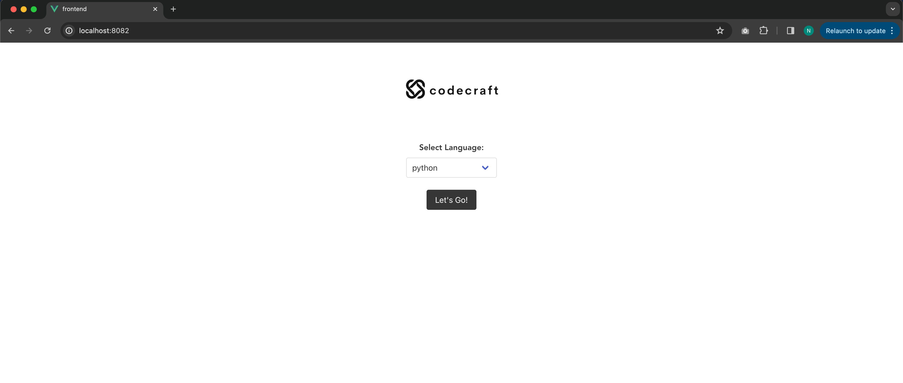
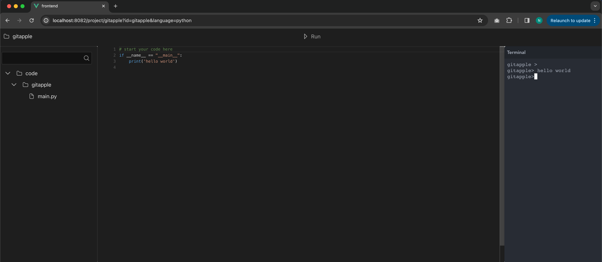

## A online code editor:
#### built using Typescript, Socket IO, AWS S3, Docker, Kubernetes, Hetzner in backend & Vue js in frontend.  
### Work in progress. 1st phase & 2nd phase completed! 
#### 1st phase: can run python file and execute bash commands and sync with S3 storage.
#### 2nd phase: created a kubernetes cluster on Hetzner and for each session a kubernetes pod will be created. Each pod will take about 500m CPU and 200MB Ram to execute programs. The purpose of using k8 is to create isolated environment for each session so no one can abuse the terminal

